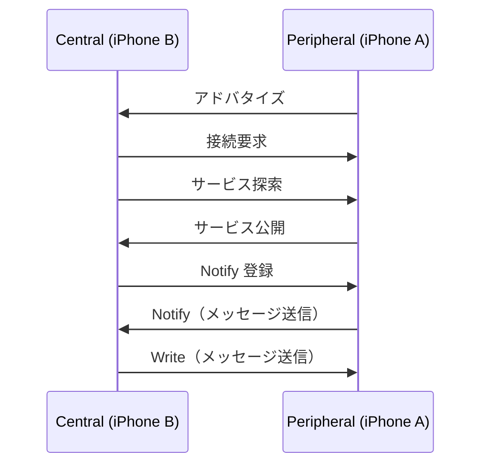

# BluetoothLowEnergyDemo

iPhone 2台をBLE（Bluetooth Low Energy）で接続し、双方向メッセージ通信の動作確認用iOSデモアプリです。

<table>
  <tr>
    <td>
      <video src="https://github.com/user-attachments/assets/1f9eee85-099d-479e-b745-e9b12e8e9bef" autoplay loop muted playsinline></video>
    </td>
    <td>
      <video src="https://github.com/user-attachments/assets/8f8ce549-85c3-44c7-8f39-06fc726d4194" autoplay loop muted playsinline></video>
    </td>
  </tr>
  <tr>
    <td align="center">Peripheral側</td>
    <td align="center">Central側</td>
  </tr>
</table>

## 機能

- Central / Peripheral モードの切り替え
- BLEデバイスのスキャン・接続
- 双方向リアルタイムメッセージ送受信
- 接続状態のログ表示

## 使い方

1. **iPhone A** でアプリを起動 → **「Peripheral（アドバタイズ側）」** を選択
2. **iPhone B** でアプリを起動 → **「Central（スキャン側）」** を選択
3. iPhone B のデバイスリストに「BLEDemo」が表示されたらタップして接続
4. 「通信準備完了！」と表示されたら双方向でメッセージを送受信できます

## 実機ビルドの手順

BLE はシミュレータでは動作しないため、実機へのビルドが必要です。

1. `Configurations/Local.xcconfig.sample` を同じディレクトリに `Local.xcconfig` としてコピーする
2. `Local.xcconfig` の `YOUR_TEAM_ID` を自分の Apple Developer Team ID に書き換える
   （Team ID は [Apple Developer サイト](https://developer.apple.com/account) の Membership ページで確認できます）
3. Xcode でプロジェクトを開き、実機を接続してビルドする

> `Local.xcconfig` は `.gitignore` に含まれているためコミットされません。

## アーキテクチャ

Observable Feature Architecture に基づいてレイヤーを分離しています。

```
BluetoothLowEnergyDemo/
├── App/                        # エントリーポイント・DI（AppEnvironment）・NavigationStack
├── Core/
│   ├── BLE/
│   │   ├── Scanner/            # スキャン実装・プロトコル・Bridge
│   │   ├── Chat/               # チャット実装・プロトコル・Bridge・イベント定義
│   │   └── BLEConstants.swift  # UUID・定数
│   ├── Domain/                 # エンティティ（ScannedDevice, BLEMessage など）
│   ├── Navigation/             # AppRoute, AppRouter
│   └── TaskRunner.swift        # テスト用 Task インジェクション
└── Features/
    ├── Home/                   # ホーム画面
    ├── Scanner/                # BLEスキャナー
    └── Chat/                   # BLEチャット
```

### 各レイヤーの責務

| レイヤー | 責務 |
|---|---|
| Core/BLE | CoreBluetooth の管理。Bridge パターンでデリゲートを抽象化し、AsyncStream で上位層にイベントを流す |
| Core/Domain | アプリのデータモデル定義（CoreBluetooth 型を持たない） |
| Core/Navigation | 型安全なルーティング（`AppRoute: Hashable` + `NavigationPath`） |
| App/AppEnvironment | DI コンテナ。live / mock を差し替えることでテスト・Preview に対応 |
| Features/*/ViewModel | 画面状態の管理。Service はプロトコル経由で注入 |
| Features/*/View | 表示のみ。ロジックを持たない |

### 通信フロー



## テスト

Swift Testing を使用し、BLE 実機不要で各レイヤーを独立してテストできます。

```
BluetoothLowEnergyDemoTests/
├── Domain/        # 値型モデルの検証（モック不要）
├── Navigation/    # AppRouter のスタック管理
├── BLEService/    # Mock に差し替えた Service 層のロジック検証
├── ViewModel/     # TaskRunner 注入による非同期 ViewModel テスト
└── Mocks/         # 各層のモック実装
```

## 技術スタック

- Swift 6
- SwiftUI（フル SwiftUI、UIKit 不使用）
- CoreBluetooth
- Swift Observation (`@Observable`)
- Swift Testing

## 要件

- iOS 18以上
- Bluetooth対応のiPhone 2台
- 実機での動作が必要（シミュレータではBluetoothが使用不可）
