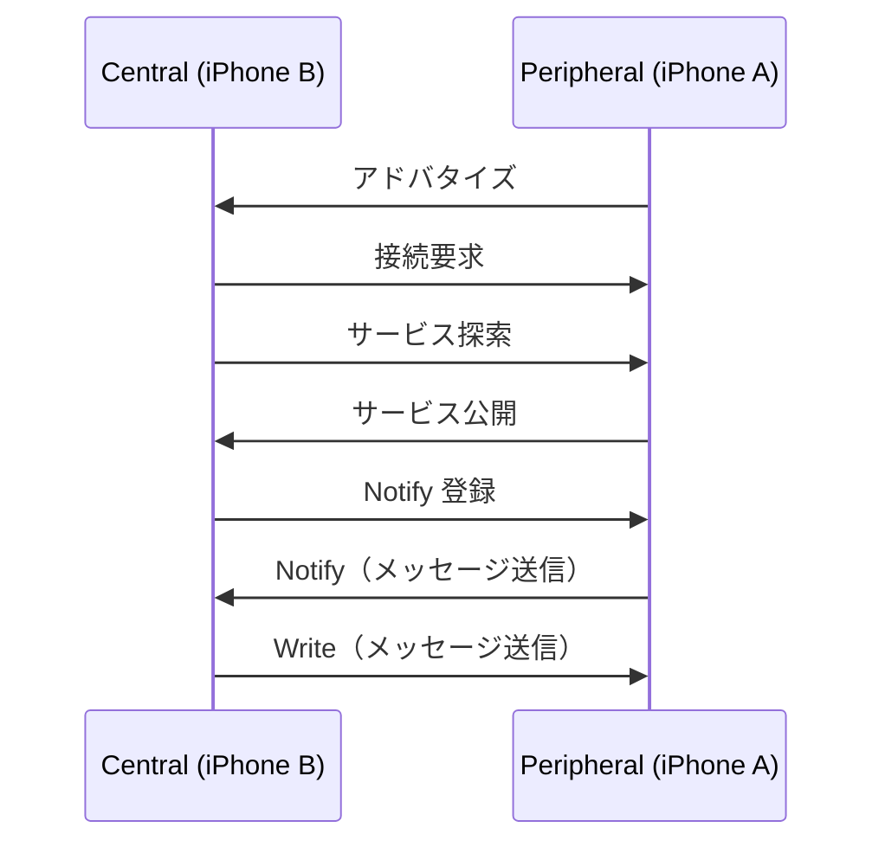

# BluetoothLowEnergyDemo

iPhone 2台をBLE（Bluetooth Low Energy）で接続し、双方向メッセージ通信を行うiOSデモアプリです。

## 機能

- Central / Peripheral モードの切り替え
- BLEデバイスのスキャン・接続
- 双方向リアルタイムメッセージ送受信
- 接続状態のログ表示

## 使い方

1. **iPhone A** でアプリを起動 → **「Peripheral（アドバタイズ側）」** を選択
2. **iPhone B** でアプリを起動 → **「Central（スキャン側）」** を選択
3. iPhone B のデバイスリストに「BLEDemo」が表示されたらタップして接続
4. 「通信準備完了！」と表示されたら双方向でメッセージを送受信できます

## アーキテクチャ

MVVM + Clean Architecture に基づいてレイヤーを分離しています。

```
BluetoothLowEnergyDemo/
├── Domain/
│   ├── BLEEntities.swift          # BLEMode, BLEMessage（エンティティ）
│   └── BLEServiceProtocol.swift   # BLEServiceProtocol, BLEServiceDelegate（インターフェース）
├── Data/
│   └── BLEService.swift           # CoreBluetooth実装
├── Presentation/
│   └── BLEViewModel.swift         # @Observable ViewModel
└── ContentView.swift              # SwiftUI View
```

### 各レイヤーの責務

| レイヤー | ファイル | 責務 |
|---|---|---|
| Domain | `BLEEntities.swift` | アプリのデータモデル定義 |
| Domain | `BLEServiceProtocol.swift` | BLE操作の抽象インターフェース |
| Data | `BLEService.swift` | CoreBluetoothの管理・接続状態の保持 |
| Presentation | `BLEViewModel.swift` | 画面状態の管理・Viewへのデータ提供 |
| Presentation | `ContentView.swift` | 表示のみ。ロジックを持たない |

### 通信フロー



## 技術スタック

- Swift 6
- SwiftUI
- CoreBluetooth
- Swift Observation (`@Observable`)

## 要件

- iOS 18以上
- Bluetooth対応のiPhone 2台
- 実機での動作が必要（シミュレータではBluetoothが使用不可）
